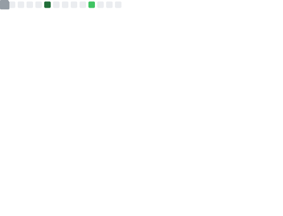

<table cellspacing="0" cellpadding="0">
    <tr>
        <td class="metrics">
            <picture>
                
            </picture>
        </td>
        <td class="image">
            <picture>
                
            </picture>
        </td>
    </tr>
</table>
<!--START_SECTION:waka-->


📊 **This Week I Spent My Time On** 

```text
💬 Programming Languages: 
No Activity Tracked This Week

🐱‍💻 Projects: 
No Activity Tracked This Week
```

**I Mostly Code in Python** 

```text
Python                   6 repos             █████░░░░░░░░░░░░░░░░░░░░   20.00 % 
C                        4 repos             ███░░░░░░░░░░░░░░░░░░░░░░   13.33 % 
Java                     3 repos             ██░░░░░░░░░░░░░░░░░░░░░░░   10.00 % 
Shell                    2 repos             ██░░░░░░░░░░░░░░░░░░░░░░░   06.67 % 
SCSS                     2 repos             ██░░░░░░░░░░░░░░░░░░░░░░░   06.67 % 
```


 Last Updated on 24/06/2026 $H:17 UTC
<!--END_SECTION:waka-->
